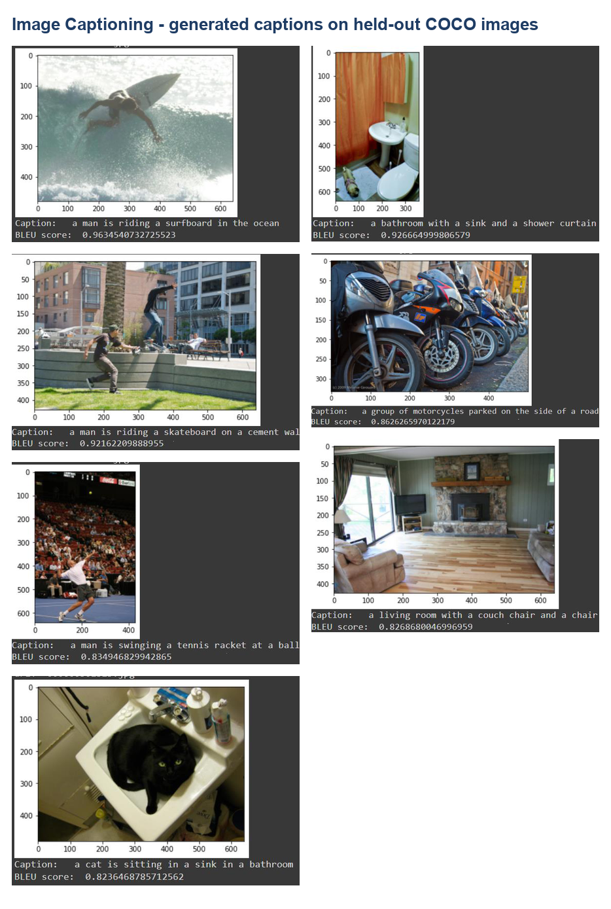
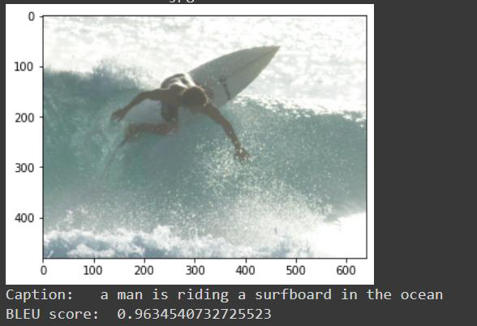
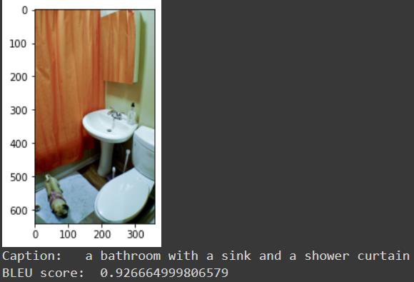
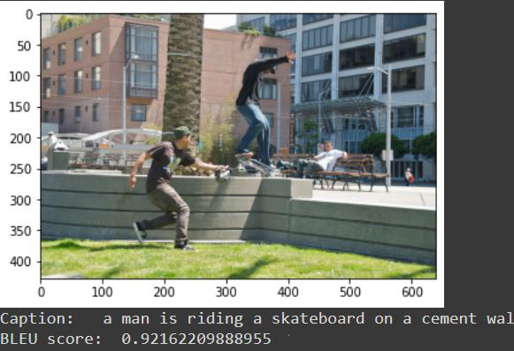
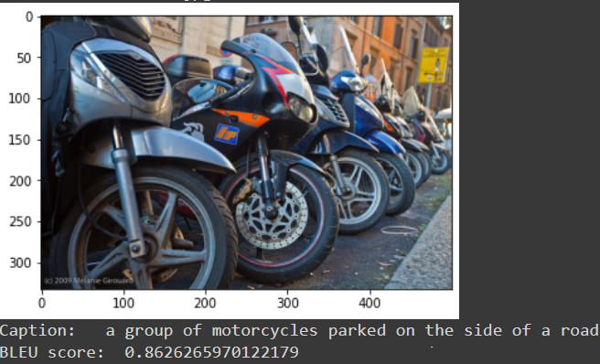
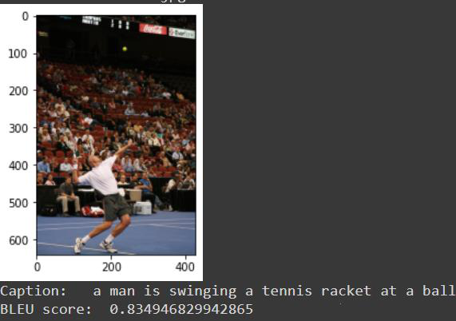
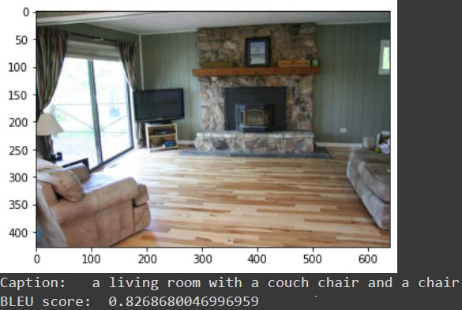
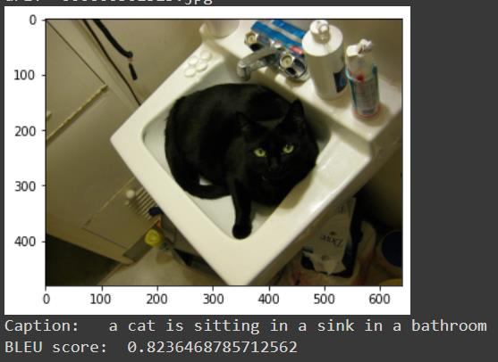

# Demo results

Captions generated by the GAN-refined model on **held-out** COCO images, with
their sentence-level BLEU scores. These are the qualitative results reported in
the thesis (Chapter 4, "Model results").

| Image                                  | Generated caption                                     | BLEU  |
| -------------------------------------- | ----------------------------------------------------- | :---: |
|                     | a man is riding a surfboard in the ocean              | 0.963 |
|                    | a bathroom with a sink and a shower curtain           | 0.927 |
|                  | a man is riding a skateboard on a cement wall         | 0.922 |
|                 | a group of motorcycles parked on the side of a road   | 0.863 |
|                      | a man is swinging a tennis racket at a ball           | 0.835 |
|                 | a living room with a couch chair and a chair          | 0.827 |
|                    | a cat is sitting in a sink in a bathroom              | 0.824 |

**Average BLEU on the test set: ~0.57** — roughly a **10 % improvement** over the
plain encoder–decoder baseline, thanks to the adversarial / SCST refinement.
